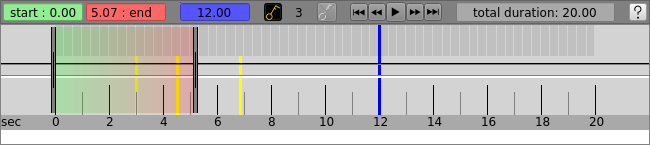
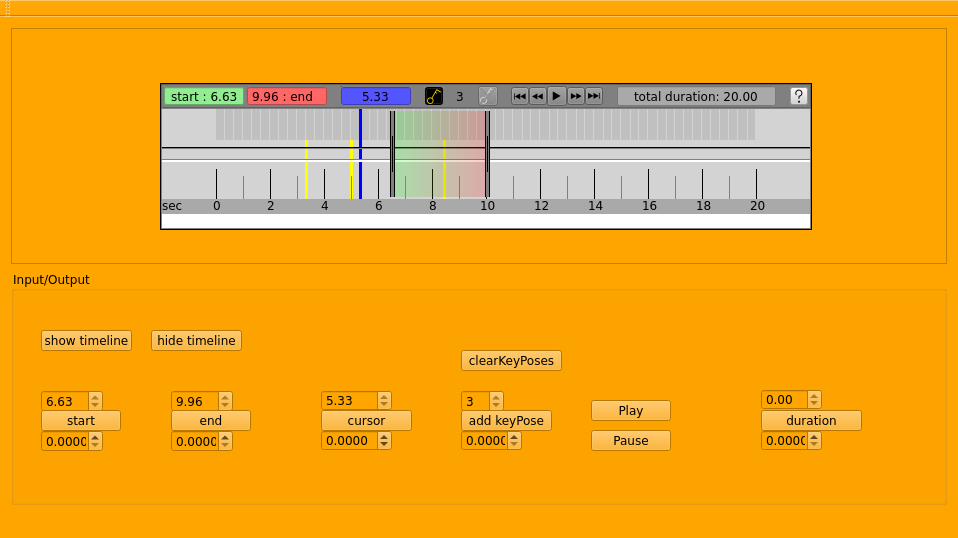

# AnimTimeline
Custom Qt widget like Blender timeline for animation



Released date : April 2019

## Build Instructions (Linux)
```bash
$ mkdir build
$ cd build
$ cmake ..
$ make
```

## Run test application
```viml
./build/AnimTimeline
```

[](https://youtu.be/0igq4E6YkDE "wiew on youtube")


## On your Qt application write
```c++
AnimTimeline * timeline = new AnimTimeline();
timeline->show(); // dialog window
```

